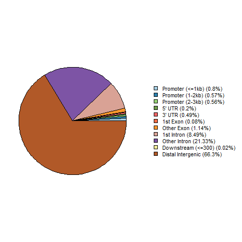

Проект по биоинформатике
========================
#### В репозитории создаем папку data и скачиваем туда 2 .bed файла ChIP-seq экспериментов из ENCODE (пики гистоновой метки).

Я сделал это несколькими командами:
* git clone https://github.com/muhuraque/hse21_H3K9me3_G4_human
* wget https://www.encodeproject.org/files/ENCFF723YDW/@@download/ENCFF723YDW.bed.gz
* wget https://www.encodeproject.org/files/ENCFF070HBN/@@download/ENCFF070HBN.bed.gz
* zcat ENCFF723YDW.bed.gz  |  cut -f1-5 > H3K9me3_HCT116.ENCFF723YDW.hg19.bed
* zcat ENCFF070HBN.bed.gz  |  cut -f1-5 > H3K9me3_HCT116.ENCFF070HBN.hg19.bed
* mkdir data
* mkdir images
* mkdir src

А потом я скопировал все нужные файлы в нужную папку, а ненужные удалил.

#### Среди ChIP-seq пиков для нужной версии генома (hg19 для человека и mm10 для мыши) выкидываем слишком длинные пики (outliers).

1. Создаем файл filter_peaks.R
2. В нем пишем вывод сначала гистограммы до филтрации, а потом после.
3. По первой гистограмме видим, что 5000 подходит идеально и мы теряем всего 12 пиков. 
4. Потом также проделываем для второго файла. (Для него получается отсечка по 2500 и потеряны всего 11 пиков) 

Получаем такие гистограммы: 

Также я зашел на сервер через команду ssh и потом туда скопировал репозиторий с помощью git clone. 

#### Смотрим, где располагаются пики гистоновой метки относительно аннотированных генов. 

Я сделал файл chip_seeker.R и запустил его. Получились такие пай-чарт графики:

#### Объединяем два набора отфильтрованных ChIP-seq пиков с помощью утилиты bedtools merge.

Я снова зашел на сервер. Сделал команду cat  *.filtered.bed  |   sort -k1,1 -k2,2n   |   bedtools merge   >  H3K9me3_HCT116.merge.hg19.bed

Потом получившийся файл с помощью git add; git commit; git push залил к себе в репозиторий. 

#### Визуализируем исходные два набора ChIP-seq пиков, а также их объединение в геномном браузере, и проверяем корректность работы bedtools merge.
Я загрузил три файла (два фильтрованных и один мердженный этих двух) в геномный браузер. Я получил такую картину: 

Как видно один из файлов сильно больше другого и поэтому второй немного пропадает на его фоне. Но видно, что мердженный файл такой же большой, примерно над первым, а значит выглядит все правильно. 

### Анализ участков вторичной стр-ры ДНК
#### Скачиваем файл со вторичной стр-рой ДНК и добавляем его на github в папку data
Я скачал файл DeepZ с помощью команды wget. И добавил в папку data.
#### Строим распределение длин участков вторичной стр-ры ДНК
Я воспользовался файлом filter_peaks.R, я запустил только первую его часть и получил гистограмму.

#### Строим график типа пай-чарт -- например, с помощью R-библиотеки ChIPseeker.
Я сделал это опять с помощью файла chip_seeker.R. Получился такой пай-чарт график:

### Анализ пересечений гистоновой метки и стр-ры ДНК
#### Находим пересечения гистоновой меткой и стр-рами ДНК.
Я зашел на сервер и ввел такую команду:
bedtools intersect  -a DeepZ.bed   -b  H3K9me3_HCT116.merge.hg19.bed  >  H3K9me3_HTC116.intersect_with_DeepZ.bed
Получилось не очень много пересечений. 

